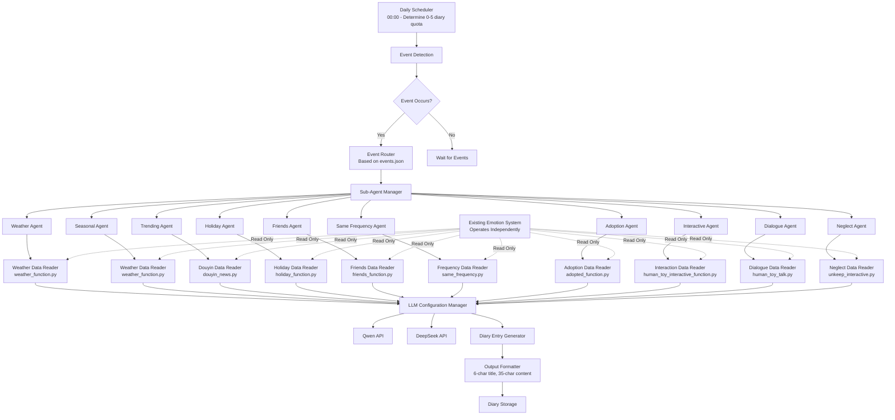

# Design Document

## Overview

The Diary Agent is a modular, event-driven system that automatically generates personalized diary entries using specialized AI sub-agents. The system operates independently from the existing emotion calculation system, focusing solely on diary generation as specified in diary_agent_specifications_en.md. Each sub-agent reads input data from the corresponding hewan_emotion_cursor_python modules to understand event context, then generates contextually relevant diary content using configurable LLM providers. The existing emotion system continues to operate independently, handling all emotion calculations and database updates.

## Architecture



## Components and Interfaces

### Integration Layer Purpose

The **integration** folder contains data readers that provide a read-only interface to existing modules. These components:

- **Read event data** from existing hewan_emotion_cursor_python modules for diary context
- **Do NOT modify** any existing emotion calculation logic or database operations  
- **Extract relevant information** needed for diary generation (event details, user preferences, timing)
- **Provide standardized data format** for diary agents to consume
- **Maintain separation** between diary generation and emotion calculation systems

For example:
- `weather_data_reader.py` reads weather conditions, user preferences, and seasonal data from weather_function.py output
- `friends_data_reader.py` reads friendship status and interaction history from friends_function.py output
- `database_reader.py` provides read-only access to user profiles and preferences needed for diary context

### Core Components

#### 1. Dairy Agent Main Controller
- **Purpose**: Central orchestrator managing the entire system lifecycle
- **Responsibilities**: 
  - Initialize sub-agents and configurations
  - Coordinate event processing workflow
  - Handle system-wide error recovery
- **Interface**: `DairyAgentController`

#### 2. Condition Checker (`condition.py`)
- **Purpose**: Evaluates trigger conditions for diary generation
- **Responsibilities**:
  - Monitor input sources (images, events, time-based triggers)
  - Evaluate condition logic
  - Signal when diary generation should begin
- **Interface**: `ConditionChecker`

#### 3. Event Router
- **Purpose**: Routes events to appropriate sub-agents based on event type
- **Responsibilities**:
  - Parse event metadata
  - Determine event classification
  - Route to specialized sub-agent
- **Interface**: `EventRouter`

#### 4. Sub-Agent Manager
- **Purpose**: Manages lifecycle and coordination of specialized sub-agents
- **Responsibilities**:
  - Load and initialize sub-agents
  - Manage sub-agent prompt configurations
  - Handle sub-agent failures and retries
- **Interface**: `SubAgentManager`

#### 5. LLM Configuration Manager
- **Purpose**: Manages multiple LLM provider configurations and failover
- **Responsibilities**:
  - Load LLM provider configurations
  - Handle API authentication and rate limiting
  - Implement failover logic between providers
- **Interface**: `LLMConfigManager`

### Sub-Agent Specifications

Each sub-agent follows a common interface but has specialized prompts and processing logic:

#### Common Sub-Agent Interface
```python
class BaseSubAgent:
    def __init__(self, prompt_config: dict, llm_config: LLMConfig, data_reader: DataReader)
    def process_event(self, event_data: dict) -> DiaryEntry
    def validate_output(self, entry: DiaryEntry) -> bool
    def get_agent_type(self) -> str
    def get_data_reader(self) -> DataReader
    def read_event_context(self, event_data: dict) -> dict
```

#### Specialized Sub-Agents with Data Source Mappings

1. **Weather Agent** (reads from weather_function.py): Generates diary entries for weather events:
   - `favorite_weather`, `dislike_weather`, `favorite_season`, `dislike_season`
   - Reads weather data, city information, and user preferences to create weather-themed diary entries
   - Generates content about weather changes, seasonal activities, and weather preferences

2. **Seasonal Agent** (reads from weather_function.py): Generates diary entries for seasonal events:
   - `favorite_season`, `dislike_season` 
   - Creates seasonal-themed diary entries about activities, temperatures, and seasonal emotions

3. **Trending Agent** (reads from douyin_news.py): Generates diary entries for trending events:
   - `celebration`, `disaster`
   - Creates diary entries about current events, celebrations, and major news
   - Incorporates trending topics and social context

4. **Holiday Agent** (reads from holiday_function.py): Generates diary entries for holiday events:
   - `approaching_holiday`, `during_holiday`, `holiday_ends`
   - Creates holiday-themed diary entries about celebrations, traditions, and holiday emotions

5. **Friends Agent** (reads from friends_function.py): Generates diary entries for friend events:
   - `made_new_friend`, `friend_deleted`, `liked_single`, `liked_3_to_5`, `liked_5_plus`, `disliked_single`, `disliked_3_to_5`, `disliked_5_plus`
   - Creates diary entries about friendships, social interactions, and relationship changes

6. **Same Frequency Agent** (reads from same_frequency.py): Generates diary entries for synchronization events:
   - `close_friend_frequency`
   - Creates diary entries about synchronized experiences with close friends

7. **Adoption Agent** (reads from adopted_function.py): Generates diary entries for claiming events:
   - `toy_claimed`
   - Creates diary entries about new ownership and bonding experiences

8. **Interactive Agent** (reads from human_toy_interactive_function.py): Generates diary entries for interaction events:
   - `liked_interaction_once`, `liked_interaction_3_to_5_times`, `liked_interaction_over_5_times`, `disliked_interaction_once`, `disliked_interaction_3_to_5_times`, `neutral_interaction_over_5_times`
   - Creates diary entries about human-toy interactions and play experiences

9. **Dialogue Agent** (reads from human_toy_talk.py): Generates diary entries for conversation events:
   - `positive_emotional_dialogue`, `negative_emotional_dialogue`
   - Creates diary entries about conversations and emotional exchanges with owner

10. **Neglect Agent** (reads from unkeep_interactive.py): Generates diary entries for neglect events:
    - `neglect_1_day_no_dialogue`, `neglect_1_day_no_interaction`, `neglect_3_days_no_dialogue`, `neglect_3_days_no_interaction`, `neglect_7_days_no_dialogue`, `neglect_7_days_no_interaction`, `neglect_15_days_no_interaction`, `neglect_30_days_no_dialogue`, `neglect_30_days_no_interaction`
    - Creates diary entries about loneliness, missing the owner, and emotional distance

## Data Models

### Event Data Structure
```python
@dataclass
class EventData:
    event_id: str
    event_type: str  # Maps to sub-agent types from events.json
    event_name: str  # Specific event name (e.g., "favorite_weather", "made_new_friend")
    timestamp: datetime
    user_id: int  # User associated with the event
    context_data: dict  # Event context read from existing modules
    metadata: dict  # Additional diary generation context

@dataclass
class DiaryContextData:
    """Context data read from existing modules for diary generation"""
    user_profile: dict  # User preferences, role, etc.
    event_details: dict  # Specific event information
    environmental_context: dict  # Weather, time, location context
    social_context: dict  # Friend interactions, relationships
    emotional_context: dict  # Current emotional state indicators
    temporal_context: dict  # Time-based information (holidays, seasons, etc.)

@dataclass
class DiaryEntry:
    entry_id: str
    user_id: int
    timestamp: datetime
    event_type: str
    event_name: str
    title: str  # Max 6 characters
    content: str  # Max 35 characters, emoji allowed
    emotion_tags: List[str]  # Selected from predefined emotions
    agent_type: str
    llm_provider: str

@dataclass
class DataReader:
    """Base interface for reading data from existing modules"""
    module_name: str
    read_only: bool = True
    
    def read_event_context(self, event_data: dict) -> DiaryContextData:
        pass
    
    def get_user_preferences(self, user_id: int) -> dict:
        pass
```

### Emotional Tags
```python
EMOTIONAL_TAGS = [
    "生气愤怒",    # Angry/Furious
    "悲伤难过",    # Sad/Upset  
    "担忧",        # Worried
    "焦虑忧愁",    # Anxious/Melancholy
    "惊讶震惊",    # Surprised/Shocked
    "好奇",        # Curious
    "羞愧",        # Confused/Ashamed
    "平静",        # Calm
    "开心快乐",    # Happy/Joyful
    "兴奋激动"     # Excited/Thrilled
]
```

### LLM Configuration Structure
```python
@dataclass
class LLMConfig:
    provider_name: str  # "qwen", "deepseek", etc.
    api_endpoint: str
    api_key: str
    model_name: str
    max_tokens: int
    temperature: float
    timeout: int
    retry_attempts: int
```

### Prompt Configuration Structure
```python
@dataclass
class PromptConfig:
    agent_type: str
    system_prompt: str
    user_prompt_template: str
    output_format: dict
    validation_rules: dict
```

## Error Handling

### Error Categories and Responses

1. **LLM API Failures**
   - Implement exponential backoff retry logic
   - Failover to alternative LLM providers
   - Queue requests for later processing if all providers fail

2. **Sub-Agent Failures**
   - Log detailed error information
   - Attempt processing with fallback generic agent
   - Continue processing other events

3. **Condition Evaluation Errors**
   - Log condition evaluation failures
   - Continue monitoring with default conditions
   - Alert system administrator

4. **Data Validation Errors**
   - Validate input event data structure
   - Sanitize and format output diary entries
   - Reject malformed data with detailed logging

### Recovery Mechanisms

- **Graceful Degradation**: System continues operating with reduced functionality
- **State Persistence**: Save processing state for recovery after failures
- **Health Monitoring**: Regular health checks for all components
- **Circuit Breaker Pattern**: Prevent cascade failures in LLM API calls

## Testing Strategy

### Unit Testing
- Test each sub-agent independently with mock event data
- Validate LLM configuration loading and failover logic
- Test condition evaluation with various input scenarios
- Verify diary entry formatting and validation

### Integration Testing
- Test end-to-end event processing workflow
- Validate Context7 MCP integration
- Test LLM provider switching and failover
- Verify data persistence and retrieval

### Performance Testing
- Load testing with multiple concurrent events
- LLM API response time monitoring
- Memory usage optimization for long-running processes
- Scalability testing with increasing event volumes

### Acceptance Testing
- Validate diary entry quality and emotional appropriateness
- Test with real-world event scenarios
- Verify compliance with character limits and formatting rules
- User acceptance testing for diary entry relevance and quality

## Context7 MCP Integration

### MCP Service Usage
- **Document Retrieval**: Access external knowledge bases for context
- **Image Processing**: Enhanced image analysis capabilities
- **Language Services**: Additional language processing tools
- **Data Enrichment**: External data sources for event context

### MCP Configuration
```json
{
  "mcpServers": {
    "context7-docs": {
      "command": "uvx",
      "args": ["context7-mcp-server@latest"],
      "env": {
        "FASTMCP_LOG_LEVEL": "ERROR"
      },
      "disabled": false,
      "autoApprove": ["resolve-library-id", "get-library-docs"]
    }
  }
}
```

## Configuration Management

### File Structure
```
diary_agent/
├── config/
│   ├── llm_configuration.json
│   ├── agent_prompts/
│   │   ├── weather_agent.json
│   │   ├── trending_agent.json
│   │   ├── holiday_agent.json
│   │   ├── friends_agent.json
│   │   ├── same_frequency_agent.json
│   │   ├── adoption_agent.json
│   │   ├── interactive_agent.json
│   │   ├── dialogue_agent.json
│   │   └── neglect_agent.json
│   └── condition_rules.json
├── agents/
│   ├── base_agent.py
│   ├── weather_agent.py
│   ├── trending_agent.py
│   ├── holiday_agent.py
│   ├── friends_agent.py
│   ├── same_frequency_agent.py
│   ├── adoption_agent.py
│   ├── interactive_agent.py
│   ├── dialogue_agent.py
│   └── neglect_agent.py
├── core/
│   ├── diary_controller.py
│   ├── condition.py
│   ├── event_router.py
│   ├── llm_manager.py
│   └── daily_scheduler.py
├── integration/  # Data readers for existing modules (read-only)
│   ├── weather_data_reader.py      # Reads weather event data for diary context
│   ├── douyin_data_reader.py       # Reads trending news data for diary context
│   ├── holiday_data_reader.py      # Reads holiday event data for diary context
│   ├── friends_data_reader.py      # Reads friend interaction data for diary context
│   ├── frequency_data_reader.py    # Reads same frequency event data for diary context
│   ├── adoption_data_reader.py     # Reads adoption event data for diary context
│   ├── interaction_data_reader.py  # Reads human-toy interaction data for diary context
│   ├── dialogue_data_reader.py     # Reads dialogue event data for diary context
│   ├── neglect_data_reader.py      # Reads neglect tracking data for diary context
│   └── database_reader.py          # Read-only database access for user context
├── data_sources/  # References to existing hewan_emotion_cursor_python modules
│   └── README.md  # Documentation of data source mappings
├── utils/
│   ├── data_models.py
│   ├── validators.py
│   ├── formatters.py
│   ├── file_reader.py
│   └── event_mapper.py
└── events.json  # Event type mappings
```

### Configuration Hot-Reloading
- Monitor configuration files for changes
- Reload LLM configurations without system restart
- Update agent prompts dynamically
- Validate configuration changes before applying

## Daily Diary Generation Process

### Daily Scheduling Logic
Based on diary_agent_specifications_en.md, the system implements:

1. **Daily Initialization (00:00)**
   - Randomly determine number of diary entries to write (0-5)
   - Reset daily counters and event type tracking
   - Initialize daily diary quota

2. **Event-Driven Diary Generation**
   - When events occur during the day, randomly determine if diary should be written
   - Read event context from corresponding existing modules via data readers
   - Generate diary entries using LLM with event context until daily quota is met
   - Ensure only one diary entry per event type per day

3. **Diary Entry Format (per specifications)**
   - **Time**: Event timestamp
   - **Emotional Tags**: Selected from 10 predefined emotions
   - **Title**: Maximum 6 characters, generated based on content
   - **Content**: Maximum 35 characters, can include emojis

4. **Event Processing Rules**
   - Claimed events must result in diary entries
   - If daily event count is insufficient, no make-up writing required
   - Alternative approach: Randomly draw event types from available categories

5. **Data Flow**
   - Event occurs → Data reader extracts context → LLM generates diary → Format & store
   - No modification of existing emotion calculation system

### Separation from Existing Emotion System
The diary generation system operates independently from the existing emotion calculation system:

- **Emotion System**: Continues to handle all emotion calculations, database updates, and API integrations independently
- **Diary System**: Focuses solely on reading event data and generating diary entries
- **Data Flow**: Diary agents read input data from existing modules to understand event context, but do not modify emotion calculations
- **Independence**: Both systems can operate simultaneously without interference
- **Scope**: Diary agent implements only the functionality specified in diary_agent_specifications_en.md
## 
Weather Function Integration

### Existing Weather Function Structure
The dairy agent integrates with the existing weather_function.py which includes:

#### Key Components:
- **WeatherAPI Integration**: Uses WeatherAPI.com with API key "3f7b39a8c1f4404f8f291326252508"
- **Role-based Weights**: "clam" and "lively" personality types with different weight multipliers
- **Emotion Calculation**: X/Y axis changes based on weather/season preferences
- **Database Integration**: Uses db_utils.py and emotion_database.py for data persistence

#### Role Weight Configuration:
```python
ROLE_WEIGHTS = {
    "clam": {
        "favorite_weather": 1.0,
        "dislike_weather": 0.5,
        "favorite_season": 1.0,
        "dislike_season": 0.5
    },
    "lively": {
        "favorite_weather": 1.5,
        "dislike_weather": 1.0,
        "favorite_season": 1.5,
        "dislike_season": 1.0
    }
}
```

#### Event Processing Flow:
1. Get user data from emotion database by user_id using `get_emotion_data()`
2. Determine city from IP address using `get_ip_city(user_ip_address)`
3. Fetch current weather from WeatherAPI.com using `get_weather_data(city_name)`
4. Calculate current season based on month using `get_current_season()`
5. Apply role-based weights and preference matching in `calculate_emotion_changes()`
6. Update emotion database with calculated changes using `update_emotion_in_database()`

#### Key Functions:
- `get_weather_data(city_name)`: Fetches weather from WeatherAPI.com
- `get_current_season()`: Returns Spring/Summer/Autumn/Winter based on month
- `calculate_emotion_changes(user_data, current_weather, current_season)`: Core logic
- `process_weather_event(user_id, user_ip_address)`: Main orchestration function

#### JSON Data Structure:
```json
{
  "id": 1,
  "name": "user_name",
  "role": "clam",
  "favorite_weathers": "[\"Clear\", \"Sunny\"]",
  "dislike_weathers": "[\"Rain\", \"Storm\"]", 
  "favorite_seasons": "[\"Spring\", \"Summer\"]",
  "dislike_seasons": "[\"Winter\"]"
}
```

#### Emotion Calculation Logic:
- **Favorite Weather/Season**: +1 X-axis (happiness), conditional Y-axis change
- **Dislike Weather/Season**: -1 X-axis (happiness), conditional Y-axis change
- **Y-axis Logic**: If X < 0 then Y+1, else Y-1 (for favorites); reverse for dislikes
- **Role Weights**: Applied after base calculation to amplify/dampen effects
- **Intimacy**: Always 0 for weather/season events

### MCP File Server Integration
The system includes a local MCP file server for accessing external files:

```python
# file_server.py - MCP server for local file access
@server.tool("read_file", description="Read the contents of a local file")
async def read_file(request: ToolRequest) -> ToolResponse:
    filepath = request.arguments.get("path")
    try:
        with open(filepath, "r", encoding="utf-8") as f:
            content = f.read()
        return ToolResponse(content=[TextContent(type="text", text=content)])
    except Exception as e:
        return ToolResponse(content=[TextContent(type="text", text=f"Error: {str(e)}")])
```